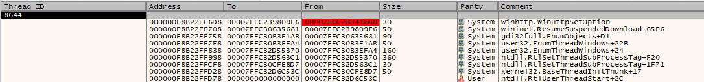

# obfuscator-ng

## Description

This project is a port from LLVM 4.0 to LLVM 19 of the original [obfuscator-llvm](https://lnkd.in/eeBkzn_U) project.

Ported and newly implemented features:

- Operation substitution
- Basic block splitting
- Control-flow flattening
- Compile-time API hashing — simple CRC32 resolution or full thread-pool evasion with stack spoofing and tail-call dispatch (Windows)
- Constant value obfuscation
- Commutative operand swapping
- Array encryption / decryption around use

For those less familiar with LLVM: LLVM is a compiler infrastructure widely used to build compilers, language toolchains, static analysers, and optimisation frameworks. One of its most powerful concepts is the **LLVM pass** — a modular transformation or analysis step that operates on the Intermediate Representation (IR) of a program.

Passes can be used for many purposes, including optimisation, instrumentation, static analysis, and — in this case — code obfuscation. By working at the IR level, LLVM passes can transform code before the final binary is generated, making them a very flexible place to implement security-research techniques.

---

## Building the project

Built and tested on **Debian Trixie (13)**.

```bash
# Dependencies
sudo apt install cmake ninja-build mingw-w64

# Compile the needed parts of the LLVM toolchain
git submodule update --init --recursive

cd llvm-project

cmake -S llvm -B build -G Ninja \
  -DCMAKE_BUILD_TYPE=Release \
  -DLLVM_ENABLE_PROJECTS="clang;lld" \
  -DLLVM_TARGETS_TO_BUILD="X86"

ninja -C build opt clang llvm-config llvm-link

# Build the Obfuscation Plugin
cd ../obfuscator

cmake -S . -B build -G Ninja \
  -DLLVM_DIR=../llvm-project/build/lib/cmake/llvm \
  -DCMAKE_BUILD_TYPE=Release

ninja -C build
```

---

## Passes

### Substitution Pass (`sub`)

Replaces simple arithmetic, logical, and binary operations with equivalent but more complex instruction sequences, making static analysis harder.

**Options**

| Flag | Description |
|---|---|
| `-passes="…sub…"` | Enable substitution (inside `function(…)`) |
| `-sub_loop=N` | Number of substitution rounds per function (default: 1) |

---

### Flattening Pass (`fla`)

Transforms the control-flow graph of a function into a dispatcher-based structure. All basic blocks are routed through a central switch statement driven by a state variable, hiding the original control flow from static analysis.

**Options**

| Flag | Description |
|---|---|
| `-passes="…fla…"` | Enable flattening (inside `function(…)`) |

---

### Split Basic Block Pass (`splitbb`)

Breaks large basic blocks into smaller ones by inserting unconditional branches. This increases the number of nodes in the control-flow graph, making automated analysis noisier.

**Options**

| Flag | Description |
|---|---|
| `-passes="…splitbb…"` | Enable splitting (inside `function(…)`) |
| `-split_num=N` | Number of instructions per split chunk (default: 2) |

---

### Constant Obfuscation Pass (`constobf`)

Replaces integer constant literals used in instructions with equivalent runtime arithmetic expressions. Instead of embedding the literal value directly in the IR, the pass emits a sequence of operations that compute the same value at runtime.

**Options**

| Flag | Description |
|---|---|
| `-passes="…constobf…"` | Enable constant obfuscation (inside `function(…)`) |

---

### SwapOps Pass (`swapops`)

For commutative binary operations (e.g. `add`, `mul`, `and`, `or`, `xor`), randomly swaps the order of the operands. This produces functionally identical code but increases variation between builds, reducing signature reliability.

**Options**

| Flag | Description |
|---|---|
| `-passes="…swapops…"` | Enable operand swapping (inside `function(…)`) |
| `-swap_prob=N` | Probability (0–100) that any given commutative operand pair is swapped (default: 50) |

---

### Array Obfuscation Pass (`arrenc`)

Encrypts global integer arrays at compile time with a keyed XOR-based scheme, then inserts decode stubs immediately before each use and re-encode stubs immediately after. The array therefore exists in plaintext in memory only for the instant it is accessed.

The pass operates at **module level** and must appear outside `function(…)` wrappers in the pipeline string.

**Options**

| Flag | Description |
|---|---|
| `-passes="…arrenc…"` | Enable array encryption (module-level, no `function()` wrapper) |
| `-arrenc_seed=0xN` | 32-bit seed used to derive per-element XOR keys |
| `-arrenc_entry=<name>` | Name of the entry-point function where global decode stubs are injected (e.g. `wmain`) |

---

### API Hashing Pass (`api_hashing`) — Windows only

Replaces direct references to selected Windows API functions with compile-time CRC32 hashes. At runtime a small resolver (`WindowsTools/APIResolver.c`, linked into the final binary) walks the export tables of loaded DLLs and resolves the real function pointer from the hash, hiding the API import list from static tools.

The pass operates at **module level** and must appear outside `function(…)` wrappers in the pipeline string.

The pass supports two resolution modes controlled by `-os`:

**Simple hashing** (`-os_version=windows -api_type=hashing`)
The resolver performs a straightforward CRC32 walk of DLL export tables and returns the function pointer directly. This is the baseline mode — fast and compatible with all Windows targets.

**Thread-pool evasion** (`-os_version=windows -api_type=threadpool`)
Instead of calling the resolved function pointer directly, the resolver dispatches the call through a Windows thread-pool callback. This breaks execution-chain heuristics used by EDR products by making the call appear to originate from a legitimate OS thread-pool worker thread. This technique has only been tested on x64 Windows 11. Three techniques are combined:

- **Thread-pool dispatch** — execution originates from a legitimate OS thread-pool worker thread rather than a directly created thread.
- **Stack spoofing** — the call stack visible to monitoring hooks is replaced with a synthetic, benign-looking frame chain (implemented in `WindowsTools/Callback.asm` and `ProxyCallbacks.cpp`).
- **Tail-call dispatch** — the final call to the target is made as a tail call, removing the obfuscation stub from the visible call stack entirely.

**Options**

| Flag | Description |
|---|---|
| `-passes="…api_hashing…"` | Enable API hashing (module-level, no `function()` wrapper) |
| `-os_version=windows -api_type=hashing` | Simple CRC32 hash resolution |
| `--os_version=windows -api_type=threadpool` | CRC32 resolution + thread-pool evasion (stack spoofing + tail-call dispatch). If function is less than 4 args it can handle later used return values. If return value is not used it can handle up to functions with 8 arguments. In other cases it uses hashing. |



---

## Testing the project

Built and tested on **Debian Trixie (13)**.

The example below compiles an obfuscated HTTPS reverse shell targeting Windows. When compiling for a Linux target, omit `-I/usr/x86_64-w64-mingw32/include` and `--target=x86_64-w64-windows-gnu`.

```bash
# 1. Emit IR for the payload and the API resolver
/path/to/llvm-project/build/bin/clang \
  -O0 -Xclang -disable-O0-optnone \
  -Wimplicit-function-declaration \
  -emit-llvm -S httpsRS.c -o httpsRS.ll \
  -I/usr/x86_64-w64-mingw32/include \
  --target=x86_64-w64-windows-gnu

/path/to/llvm-project/build/bin/clang \
  -O0 -Xclang -disable-O0-optnone \
  -emit-llvm -S APIResolver.c -o APIResolver.ll \
  -I/usr/x86_64-w64-mingw32/include \
  --target=x86_64-w64-windows-gnu

/path/to/llvm-project/build/bin/clang \
  -O0 -Xclang -disable-O0-optnone \
  -emit-llvm -S decoder.c -o decoder.ll \
  -I/usr/x86_64-w64-mingw32/include \
  --target=x86_64-w64-windows-gnu

# 2. Link IR files together
/path/to/llvm-project/build/bin/llvm-link \
  APIResolver.ll httpsRS.ll decoder.ll -S -o hack.ll

# 3. Run the obfuscation passes
/path/to/llvm-project/build/bin/opt \
  -load-pass-plugin "../../build/ObfuscationPlugin.so" \
  -passes="api_hashing,function(constobf),function(swapops),function(sub),function(splitbb),function(fla),arrenc,verify" \
  -swap_prob=67 \
  -arrenc_seed=0xAABBCCDD \
  -os_version=windows \
  -api_type=hashing \
  -api_entry=main \
  -sub_loop=2 \
  -split_num=2 \
  -S "hack.ll" -o "out.ll"

# 4. Compile to final binary
/path/to/llvm-project/build/bin/clang out.ll --target=x86_64-w64-windows-gnu
```

See `obfuscator/test/` for a ready-to-use example and a `compile_example.sh` script.

> **`compile_example.sh` prerequisites**
> The script uses `clang-cl` (the MSVC-compatible Clang driver) to produce a genuine Windows PE without a MinGW runtime dependency. It also requires the Windows SDK headers and import libraries provided by [xwin](https://github.com/Jake-Shadle/xwin). Before running the script, populate the xwin cache and update the path inside it:
>
> ```bash
> # xwin cache must exist at this path (adjust version/arch as needed):
> xwin-0.9.0-x86_64-unknown-linux-musl/.xwin-cache/splat
> ```
>
> Edit the `XWIN_SPLAT` (or equivalent) variable at the top of `compile_example.sh` to point at your actual splat directory if you used a different xwin version or install location.

---

## Pass pipeline reference

| Pass name | Level | Wrapper needed |
|---|---|---|
| `api_hashing` | Module | No `function()` wrapper |
| `constobf` | Function | `function(constobf)` |
| `swapops` | Function | `function(swapops)` |
| `sub` | Function | `function(sub)` |
| `splitbb` | Function | `function(splitbb)` |
| `fla` | Function | `function(fla)` |
| `arrenc` | Module | No `function()` wrapper |

> Thread-pool evasion is a **mode of `api_hashing`** selected via `-os_version=windows -api_type=threadpool`, not a separate pass.

Recommended order (function passes run inside a single `function(…)` scope, module passes run before or after):

```
api_hashing,function(constobf),function(swapops),function(sub),function(splitbb),function(fla),verify
```

---

## Extra

There is an example program and compilation steps in `obfuscator/test/` that has bypassed the following security solutions:

- Microsoft Defender
- Avast
- Malwarebytes
- Bitdefender Free *(when using `httpsRS.c` — the reverse-shell interface is a little unstable)*
